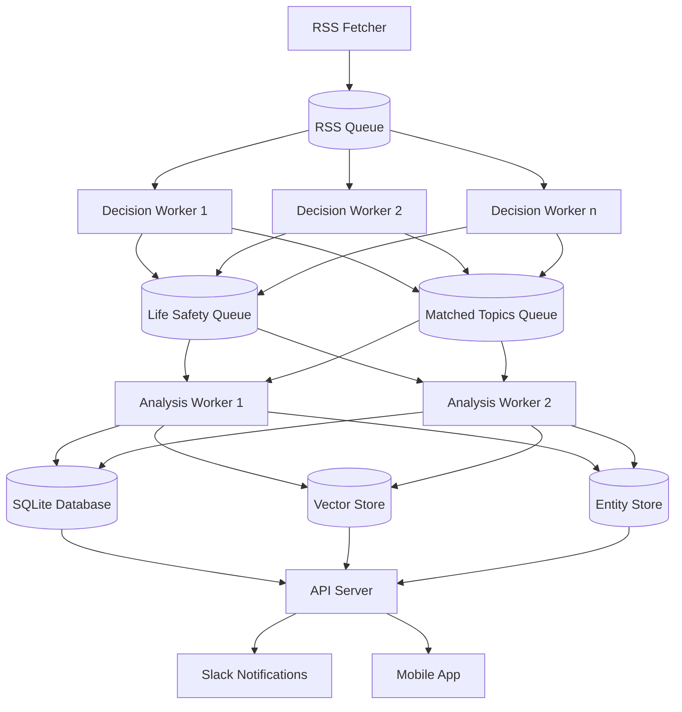

# Argus System Patterns

## Architectural Overview
Argus employs a multi-worker processing pipeline architecture that maximizes throughput and resilience. The system comprises several specialized worker types that operate concurrently to process different stages of the content lifecycle.



## Core Design Patterns

### 1. Worker Pipeline Pattern
- **Workers**: Specialized processes for specific tasks (RSS fetching, decision making, analysis)
- **Message Queues**: Database tables functioning as work queues
- **Concurrency**: Multiple workers processing items simultaneously
- **Load Distribution**: Random and prioritized queue item selection

### 2. Content Processing Pipeline


### 3. Database Patterns
- **Central SQLite Database**: Persistent storage with structured schema
- **Queue Tables**: RSS, Matched Topics, and Life Safety queues
- **Article Storage**: Complete content with analysis metadata
- **Entity Storage**: Named entity extraction with relationships
- **Index Optimization**: Strategic indexing for query performance

### 4. Content Matching Patterns
1. **Multi-Factor Similarity**
   - Combines vector similarity (60% weight), entity overlap (30% weight), and temporal proximity (10% weight)
   - Enforces minimum threshold (0.70) that requires both vector similarity and entity overlap
   - Provides transparency with detailed similarity metrics for debugging and improvement
   - Ensures consistent weighting across all code paths
   
2. **Vector Similarity Matching**
   - Embeds article summaries into vector space using Qdrant
   - Calculates cosine similarity between embeddings
   - Retrieves vectors directly from Qdrant for comparison
   - Handles special cases like self-comparisons with explicit logic
   
3. **Entity-Based Matching**
   - Extracts named entities (people, organizations, locations, events) with structured LLM prompts
   - Normalizes entity names for consistent matching
   - Tracks entity importance (PRIMARY, SECONDARY, MENTIONED)
   - Links articles sharing significant entities with importance-based weighting
   - Performs entity type-specific scoring (person, organization, location, event)
   
4. **Temporal Correlation**
   - Tracks publication dates and event dates
   - Uses dynamic date windows for related article matching (14 days before to 1 day after)
   - Groups content related to the same timeframe
   - Enables chronological event tracking
   
5. **Dual-Query Approach**
   - Combines entity-based and vector-based search results
   - Ensures high recall by capturing matches from both approaches
   - Deduplicates and ranks results based on combined score
   - Provides fallback patterns when one approach fails

6. **Database-Driven Entity Alias System**
   - Replaces static hardcoded aliases with dynamic database-backed approach
   - Uses multi-tier matching strategy:
     * Direct matching after basic normalization
     * Database alias lookup for known entity variations
     * Fuzzy matching with configurable thresholds as fallback
     * Negative match checking to prevent repeated false positives
   - Implements alias discovery through multiple sources:
     * Pattern-based extraction from text (e.g., "X, formerly known as Y")
     * LLM-based alias detection using specialized prompts
     * User feedback and manual corrections
     * Cross-article entity correlation analysis
   - Employs learning mechanisms:
     * Confidence scoring based on source reliability
     * Pattern effectiveness tracking and optimization
     * Negative learning to avoid repeated mistakes
     * Usage statistics to prioritize common aliases

   ```mermaid
   flowchart TD
     Input[Entity Name] --> BasicNorm[Basic Normalization]
     BasicNorm --> Cache{Cache Lookup}
     Cache -->|Hit| Return[Return Result]
     
     Cache -->|Miss| DBLookup{Database Lookup}
     DBLookup -->|Match| ReturnDB[Return Result]
     DBLookup -->|No Match| NegCheck{Negative Check}
     
     NegCheck -->|Blacklisted| ReturnNeg[Return No Match]
     NegCheck -->|Not Blacklisted| Fuzzy{Fuzzy Matching}
     
     Fuzzy -->|Above Threshold| LogSuggestion[Log Suggestion]
     LogSuggestion --> ReturnFuzzy[Return Match]
     
     Fuzzy -->|Below Threshold| ReturnNoMatch[Return No Match]
   ```

### 5. Analysis Patterns
- **Multi-Stage Analysis**: Progressive refinement of content understanding
- **Quality Scoring**: Source quality and argument quality metrics
- **Actionable Content**: Generating practical recommendations and discussion points
  - *Action Recommendations*: Providing 3-5 concrete, practical steps users can take based on article content
  - *Talking Points*: Creating 3-5 discussion-worthy topics to facilitate sharing and conversation
- **Fallback Mechanism**: Adaptive worker behavior during idle periods

### 6. Notification Patterns
- **Topic-Based Filtering**: User subscription to specific topics
- **Priority-Based Delivery**: Life safety alerts receive highest priority
- **Multi-Channel Distribution**: Slack and mobile application delivery
- **Rich Content Display**: Formatted analysis with embedded metadata

## Key Implementation Patterns

### Article Clustering System
- **Clustering Strategy**: Entity-centric approach to grouping related articles
  ```mermaid
  flowchart TD
    A[New Article] --> B[Entity Extraction]
    B --> C{Find Matching Cluster}
    C -->|Match Found| D[Add to Existing Cluster]
    C -->|No Match| E[Create New Cluster]
    D --> F[Update Cluster Summary]
    E --> F
    F --> G[Calculate Importance Score]
    G --> H[Update User Preferences]
  ```

- **Storage Architecture**:
  - `article_clusters`: Central table for cluster metadata, summaries, and metrics
  - `article_cluster_mappings`: Many-to-many relationships between articles and clusters
  - `user_cluster_preferences`: User-specific settings for cluster interactions
  - Comprehensive indexing for optimized query performance

- **Integration Patterns**:
  - In-line clustering during article analysis
  - Batch processing for historical articles
  - Automatic summary generation using existing LLM infrastructure
  - Importance scoring based on multiple factors (article count, quality, recency)
  - Enhanced article worker to handle all clustering operations

- **Core Operations**:
  - **Cluster Assignment**: Identifying the best cluster for an article based on entity overlap
  - **Summary Generation**: Creating cohesive summaries across multiple related articles
  - **Significance Calculation**: Weighted scoring to prioritize important clusters
  - **User Preference Management**: Tracking user interactions with specific clusters

- **Query Optimization**:
  - Strategic indexing on frequently queried fields
  - Batch operations for efficiency
  - Query caching for repeated operations
  - Optimized join patterns for related data retrieval

### Worker Management
- **Startup Sequence**: Orderly initialization of system components
- **Worker Configuration**: Environment-based configuration
- **Error Handling**: Graceful failure recovery with logging
- **Retry Logic**: Exponential backoff for transient failures

### Content Processing 
- **URL Normalization**: Consistent handling of URLs to prevent duplicates
- **Hash-Based Deduplication**: Content-based duplicate detection
- **HTML Parsing**: Robust extraction of article content
- **Quality Thresholds**: Minimum requirements for processing

### Entity Extraction
- **Entity Recognition**: LLM-based identification of named entities
- **Entity Categorization**: Classification by type (PERSON, ORGANIZATION, etc.)
- **Importance Ranking**: Determination of entity significance to article
- **Normalization**: Standardization of entity names for matching

### Entity Alias Management
- **Single Source of Truth**: Database-driven approach for all alias operations
- **Progressive Matching Fallback**:
  1. Exact match after basic normalization (fastest)
  2. Database-driven alias lookup (reliable)
  3. Fuzzy matching with configurable thresholds (flexible)
  4. Pattern-based matching for specific entity types (specialized)
- **Confidence Scoring System**:
  - Source-based weighting (admin > user feedback > pattern > LLM)
  - Similarity-based adjustment (higher confidence for closer matches)
  - Entity type-specific thresholds (different for person, organization, etc.)
  - Usage-based reinforcement (frequently matched pairs gain confidence)
- **Intelligent Discovery**:
  - Text pattern extraction (regex-based and grammar parsing)
  - LLM semantic analysis (specialized prompts for alias identification)
  - Cross-article co-reference detection (statistical co-occurrence analysis)
  - User feedback integration (corrections and suggestions)
- **Performance Optimization**:
  - Two-level caching (memory and disk)
  - Alias batch processing for efficiency
  - Strategic indexing on normalized forms
  - Hit frequency tracking for cache optimization
- **Administrative Workflow**:
  - CLI tools for alias management
  - Batch review and approval process
  - Statistical tracking and reporting
  - Export/import capabilities

### Data Persistence
- **Transaction Management**: ACID compliance for critical operations
- **Concurrent Access**: Safe multi-worker database operations
- **Query Optimization**: Performance-tuned database interactions
- **Schema Evolution**: Forward-compatible database design
