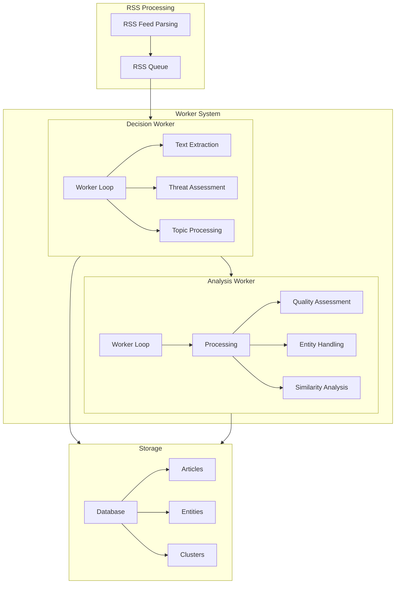
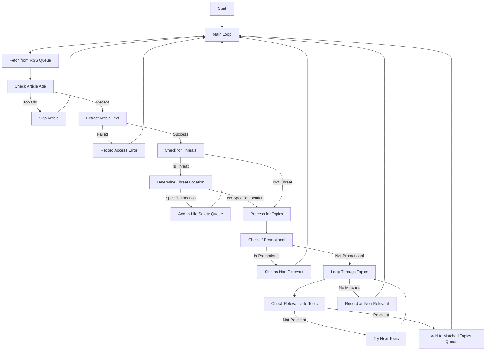
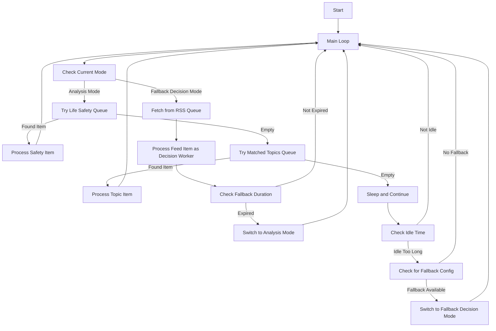

# System Patterns and Architecture

## Core Architecture

Argus is a modular Rust application built around several key components:

1. **RSS Fetching**: Gather news and content from configured RSS feeds
2. **Content Processing**: Extract and analyze article content
3. **Decision Making**: Determine relevance and priority of articles
4. **Analysis**: Perform in-depth analysis of relevant articles
5. **Database Storage**: Store articles, analysis results, and metadata
6. **API Interface**: Expose results and controls to users

## RSS Module Architecture

The RSS module is organized in a modular fashion to handle feed fetching, parsing, and processing:

```
src/rss/
├── mod.rs           # Main module exports
├── types.rs         # RSS data types and constants
├── client.rs        # HTTP client functionality
├── parser.rs        # Feed content parsing
├── fetcher.rs       # RSS feed fetching loop
├── test.rs          # Testing and diagnostic tools
└── util.rs          # Helper functions
```

## Worker System Architecture

The worker system is a crucial component, operating with a modular pattern:



### Worker Module Organization

The worker system is now organized in a modular fashion:

```
src/workers/
├── mod.rs                 # Main module export
├── common.rs              # Shared functionality between workers
├── analysis/              # Analysis worker components
│   ├── mod.rs             # Module exports
│   ├── worker_loop.rs     # Main analysis worker loop
│   ├── processing.rs      # Processing logic
│   ├── quality.rs         # Quality assessment functionality
│   ├── similarity.rs      # Similarity calculation
│   └── entity_handling.rs # Entity extraction and processing
└── decision/              # Decision worker components
    ├── mod.rs             # Module exports
    ├── worker_loop.rs     # Main decision worker loop
    ├── processing.rs      # Processing logic
    ├── extraction.rs      # Article text extraction
    └── threat.rs          # Threat assessment functionality
```

#### Decision Worker Flow



#### Analysis Worker Flow



### Prompt System Architecture

The prompt system is organized in a modular fashion to match the workers system:

```
src/prompt/
├── mod.rs               # Main module with exports
├── analysis.rs          # Analysis-related prompts
├── common.rs            # Common prompt utilities
├── decisions.rs         # Decision-making prompts
├── entity.rs            # Entity-related prompts
├── insights.rs          # Insight generation prompts
├── relevance.rs         # Relevance assessment prompts
├── scoring.rs           # Quality scoring prompts
└── summarization.rs     # Summary generation prompts
```

## Database Architecture

The database layer is organized as follows:

```
src/db/
├── mod.rs              # Main module exports
├── core.rs             # Core database functionality
├── article.rs          # Article-related operations
├── cluster.rs          # Clustering functionality
├── device.rs           # Device management
├── queue.rs            # Queue operations
├── schema.rs           # Database schema
└── entity/             # Entity subsystem
    ├── mod.rs          # Entity module exports
    ├── core.rs         # Core entity functionality
    ├── alias.rs        # Entity alias handling
    └── relation.rs     # Entity relationship handling
```

## Entity System

The entity system handles the extraction, normalization, and relationship management of entities:

```
src/entity/
├── mod.rs              # Main module exports
├── aliases.rs          # Alias management
├── extraction.rs       # Entity extraction
├── matching.rs         # Entity matching
├── normalizer.rs       # Entity normalization
├── repository.rs       # Entity storage
└── types.rs            # Entity type definitions
```

## Worker Communication Pattern

Workers communicate through the database using specialized queues:

1. **RSS Queue**: Contains URLs to be processed by Decision Workers
2. **Life Safety Queue**: Urgent items about threats requiring immediate analysis
3. **Matched Topics Queue**: Articles matching configured topics requiring analysis

## Fallback Pattern

The analysis worker implements a fallback pattern that allows it to:

1. Monitor its idle time
2. Switch to act as a Decision worker if idle too long
3. Process RSS queue items directly during fallback mode
4. Switch back to Analysis mode after a predetermined time

This enables efficient resource utilization when there are no analysis tasks pending.
