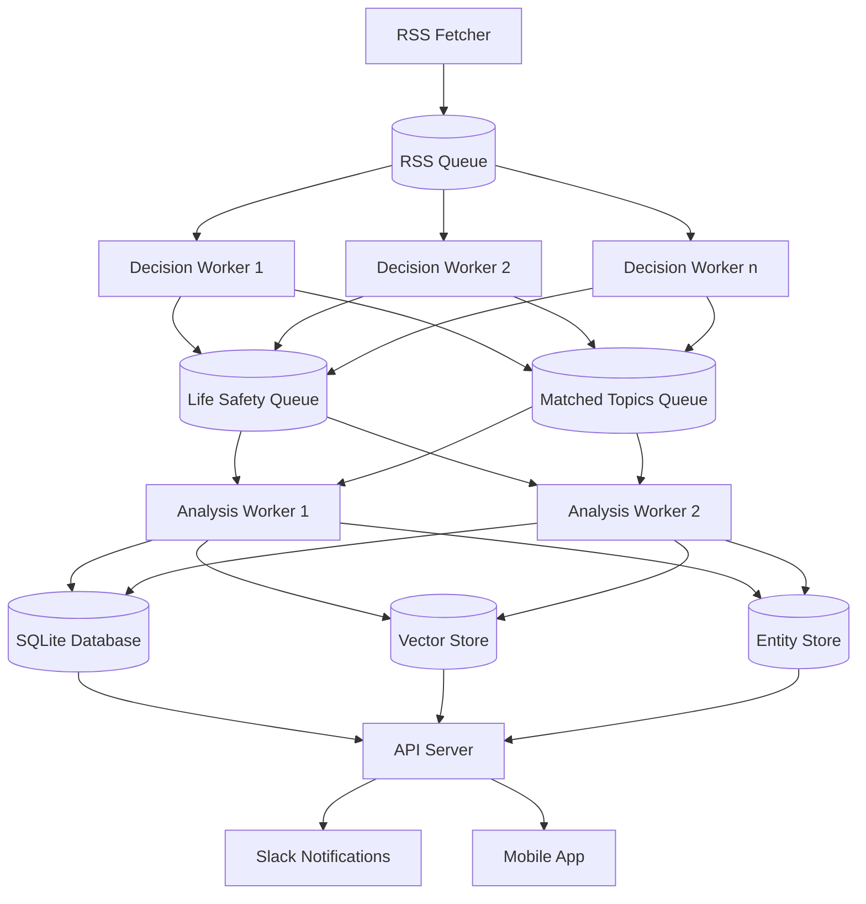

# Argus System Patterns

## Architectural Overview
Argus employs a multi-worker processing pipeline architecture that maximizes throughput and resilience. The system comprises several specialized worker types that operate concurrently to process different stages of the content lifecycle.

## Core Design Patterns

### 1. Worker Pipeline Pattern
- **Workers**: Specialized processes for specific tasks (RSS fetching, decision making, analysis)
- **Message Queues**: Database tables functioning as work queues
- **Concurrency**: Multiple workers processing items simultaneously
- **Load Distribution**: Random and prioritized queue item selection

### 2. Content Processing Pipeline

### 3. Database Patterns
- **Central SQLite Database**: Persistent storage with structured schema
- **Queue Tables**: RSS, Matched Topics, and Life Safety queues
- **Article Storage**: Complete content with analysis metadata
- **Entity Storage**: Named entity extraction with relationships
- **Index Optimization**: Strategic indexing for query performance

### 4. Content Matching Patterns
1. **Multi-Factor Similarity**
   - Combines vector similarity (60% weight), entity overlap (30% weight), and temporal proximity (10% weight)
   - Enforces minimum threshold (0.75) that requires both vector similarity and entity overlap
   - Provides transparency with detailed similarity metrics for debugging and improvement
   - Ensures consistent weighting across all code paths
   
2. **Vector Similarity Matching**
   - Embeds article summaries into vector space using Qdrant
   - Calculates cosine similarity between embeddings
   - Retrieves vectors directly from Qdrant for comparison
   - Handles special cases like self-comparisons with explicit logic
   
3. **Entity-Based Matching**
   - Extracts named entities (people, organizations, locations, events) with structured LLM prompts
   - Normalizes entity names for consistent matching
   - Tracks entity importance (PRIMARY, SECONDARY, MENTIONED)
   - Links articles sharing significant entities with importance-based weighting
   - Performs entity type-specific scoring (person, organization, location, event)
   
4. **Temporal Correlation**
   - Tracks publication dates and event dates
   - Uses dynamic date windows for related article matching (14 days before to 1 day after)
   - Groups content related to the same timeframe
   - Enables chronological event tracking
   
5. **Dual-Query Approach**
   - Combines entity-based and vector-based search results
   - Ensures high recall by capturing matches from both approaches
   - Deduplicates and ranks results based on combined score
   - Provides fallback patterns when one approach fails

### 5. Analysis Patterns
- **Multi-Stage Analysis**: Progressive refinement of content understanding
- **Quality Scoring**: Source quality and argument quality metrics
- **Actionable Content**: Generating practical recommendations and discussion points
  - *Action Recommendations*: Providing 3-5 concrete, practical steps users can take based on article content
  - *Talking Points*: Creating 3-5 discussion-worthy topics to facilitate sharing and conversation
- **Fallback Mechanism**: Adaptive worker behavior during idle periods

### 6. Notification Patterns
- **Topic-Based Filtering**: User subscription to specific topics
- **Priority-Based Delivery**: Life safety alerts receive highest priority
- **Multi-Channel Distribution**: Slack and mobile application delivery
- **Rich Content Display**: Formatted analysis with embedded metadata

## Key Implementation Patterns

### Worker Management
- **Startup Sequence**: Orderly initialization of system components
- **Worker Configuration**: Environment-based configuration
- **Error Handling**: Graceful failure recovery with logging
- **Retry Logic**: Exponential backoff for transient failures

### Content Processing 
- **URL Normalization**: Consistent handling of URLs to prevent duplicates
- **Hash-Based Deduplication**: Content-based duplicate detection
- **HTML Parsing**: Robust extraction of article content
- **Quality Thresholds**: Minimum requirements for processing

### Entity Extraction
- **Entity Recognition**: LLM-based identification of named entities
- **Entity Categorization**: Classification by type (PERSON, ORGANIZATION, etc.)
- **Importance Ranking**: Determination of entity significance to article
- **Normalization**: Standardization of entity names for matching

### Data Persistence
- **Transaction Management**: ACID compliance for critical operations
- **Concurrent Access**: Safe multi-worker database operations
- **Query Optimization**: Performance-tuned database interactions
- **Schema Evolution**: Forward-compatible database design
